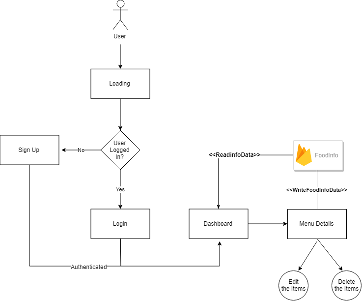

# Foodie

Foodie is an app that let's the user put some ingredients and receive some recipe suggestions.

### Project Info

Main objective of this project was to have single base code base for the IOS and Android with logic and view seperated 

#### Project Structure 
```

    /android                - React native android source code
    	/app                - React native specific code
	/api		    - API module class. Each file will be feature based like ProductAPI, LoginAPI etc
        /components         - react native components
	/config		    - Universal styles,images,metrics
        /feature            - Config File
        /lib                - Lib helper file   
        /navigation         - All naviagtion related studd including helpers functions and navigation stack
        /store              - store config
        /App.js             - App Root component    
    /assets                 - contains image and fonts
    /ios                    - React native ios source code
     
```

This project is configured with redux, redux saga and redux persist. Latest version of react-navigation with NavigationService instead of Redux Integration. This Type based Architecture scales smoothly based on this application


#### Architecture Flow 



#### Project Requirement 
* Front-End: react-native: 0.59.9 / react-native-cli: 2.0.1
* Backend : JSON 
* Database : Firestore Database

#### User login 
* username: test
* Password: 1234
